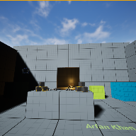

# Project Name  MDEV1003VR_Starter

## Description

A github repository for the in class demonstration code to develop VR application and allow testing on non-VR screen/laptop.    
 
## Usage
Clone, or download the zip, to a local directory. Open in Unreal Engine 5.4 or newer

## Attributions
1) Based on video by Stephan Anemaat, ( https://youtu.be/k-nlcAYXMW0 )
2) editor splash screen logo by Georgian
3) glow stick and flashlight by S Benoit, ( https://sketchfab.com/scbenoit/models )

